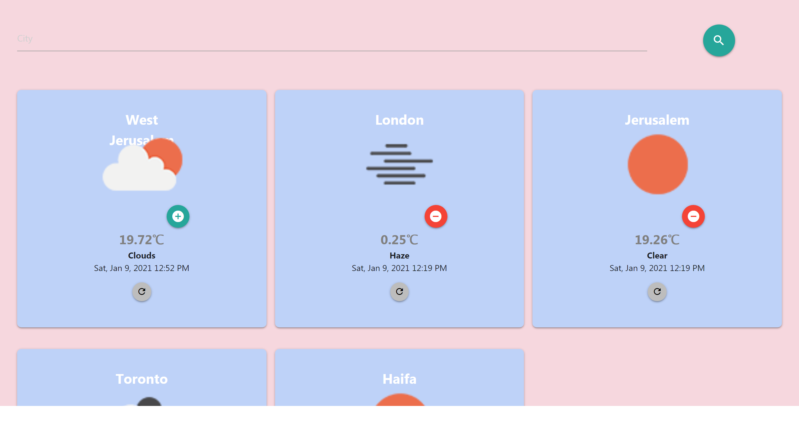
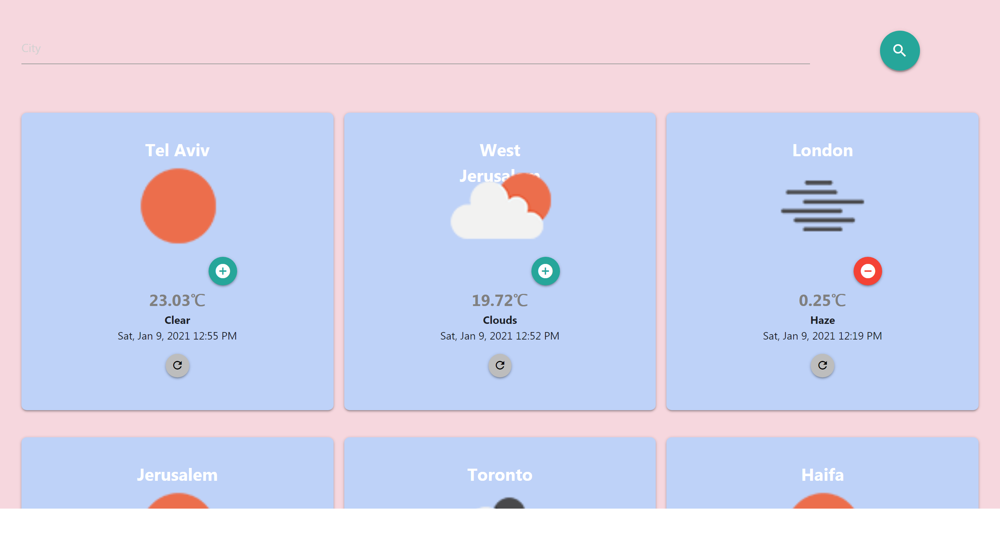
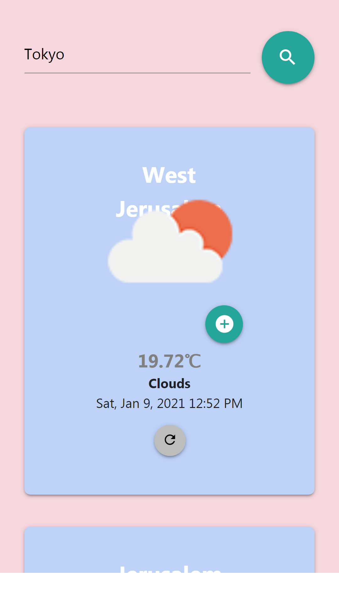
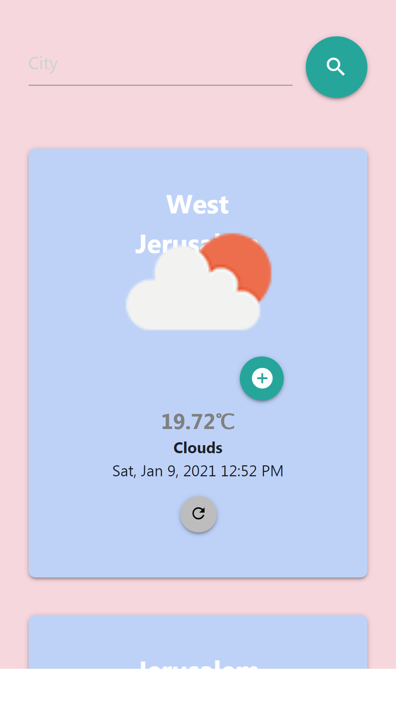

# WeatherApp

Full Stack Weather Application using data from [openweathermap API](https://openweathermap.org/api)

## 📷 project Screenshots

### Desktop and big screens 💻

 
 

### Mobile 📱

 
 
 

## 🌟 Features 

- It Display **current Location** weather (if the user allowed it) at the top, along with the saved cities weather data in the database. 🌐
- User can **search** by city name to get its weather data. 🔍
- User can **Save/Remove** city data into/from the database. 📥📤
- The city weather data gets **updated** automatically every 3 hours, unless the user clicked on the **refresh** button on specific city to update it before. 🔃 🕒
- Has **responsive** design on different screen sizes.

## 💻 Technology used

- Client-side: JavaScript, jQuery, Handlebars, HTML and CSS
- Server: NodeJs, Express, mongoose 
- Database: MongoDB
- External API is [Open Weather Map API](https://openweathermap.org/api) 

## 🔧 Getting Started

- Clone this repository. You will need `node`, `npm` and `MongoDB` installed globally on your machine.
- **Windows:** run `mongod` in the command line 
- run `npm install`
- run `node server.js`
- Open `http://localhost:3000/` in the browser

